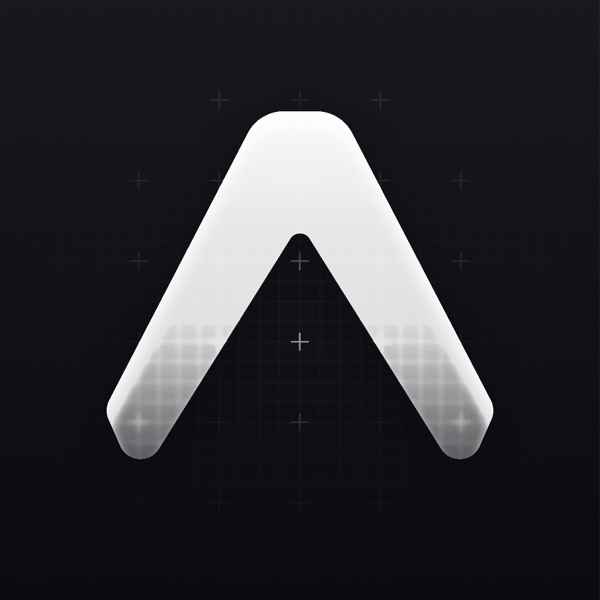
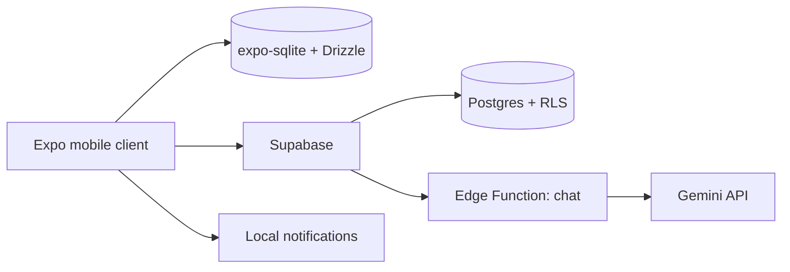

<div align="center">
  
</div>

<h1 align="center">Anvil</h1>

<p align="center">
  A futuristic, offline-first workout tracker for mobile.
</p>

<p align="center">
  
  
  
</p>

## What Anvil is

Build and follow structured training routines, swap exercises when
equipment isn't free, watch form videos without leaving the app, chat with
an AI coach, and keep a Duolingo-style streak going — all fully usable with
no connection, syncing to the cloud when you're back online.

## Product principles

- **Offline-first, always.** Every core workflow — building a routine,
  running a session, logging a set — works with no connection. Cloud sync
  is a convenience layered on top, not a requirement.
- **Cut scope honestly.** What's missing is named the day it's cut, with
  the reasoning, in [`DIARY.md`](./DIARY.md) — never silently dropped.
- **Accessibility is not optional.** A full WCAG-AA contrast pass and a
  dedicated VoiceOver-semantics audit, not a checkbox.
- **Verify for real.** No simulator tap automation in this project's build
  environment forced a discipline of direct SQLite state seeding, real
  end-to-end checks for anything server-side, and unit tests for every
  piece of pure logic — evidence over assumption.

## Architecture



## Features

- Structured routine builder (name, weight, reps, sets, video per exercise),
  with optional muscle-group tagging per day and 48-hour rest-conflict
  detection between days sharing a muscle group
- Guided onboarding (height/weight/goal → starter routine) or fully manual setup
- Workout session flow: real YouTube thumbnail previews, per-set logging
  with a skippable rest timer, an "Up next" list of the day's remaining
  exercises, and a drag-to-confirm "slide to finish" control (with a
  VoiceOver/TalkBack double-tap fallback) instead of a single tap
- Manual day-choice flow when you'd rather pick than follow the schedule
- Exercise substitution: swap to a bodyweight/dumbbell/free alternative when
  a machine isn't available, with reps/sets adjusted automatically
- In-app exercise videos, playing inside the app, never redirecting out —
  your own YouTube link works today; auto-recommended search is written
  but waiting on a YouTube Data API key
- Daily/monthly goals, workout streaks, and achievement badges
- Local reminders (a daily tip, a re-engagement nudge if you've been away)
- An in-app AI coach (Gemini) that answers questions grounded in your
  actual routine, not generic advice
- Workout history, a weight-progression chart, and an 8-week streak calendar
- Account + backup/restore sync, with full offline support as the default
  mode — true continuous multi-device merge is a deliberately deferred,
  harder problem (see `DIARY.md`, Day 10)

## Tech stack

| Layer | Choice |
|---|---|
| Mobile client | React Native (Expo, TypeScript), Expo Router |
| Styling / animation | NativeWind (Tailwind), Reanimated 3, `react-native-skia` |
| State | Zustand |
| Local offline storage | `expo-sqlite` + Drizzle ORM |
| Backend | Supabase (Postgres, Auth, Row Level Security, Edge Functions) |
| AI coach | Gemini API, proxied through a Supabase Edge Function |
| Video | YouTube IFrame Player API via `react-native-youtube-iframe` (in-app only) |
| Testing | Jest + React Native Testing Library, Maestro (E2E) |

See the project plan for the full technology-foundation comparison and
reasoning (React Native + Expo vs. Flutter vs. fully native, and Supabase vs.
a hand-rolled backend).

## Repository layout

```text
Anvil/
├── app/            # Expo (React Native) mobile client
├── supabase/       # Postgres migrations + Edge Functions (added when cloud sync lands)
├── DIARY.md        # Running build log, one entry per feature/refactor day
└── README.md
```

## Local development

Requires Node 20+, [pnpm](https://pnpm.io), and Xcode (iOS Simulator) and/or
Android Studio (Android emulator).

```bash
pnpm install
pnpm start          # launches Expo for the app/ package
```

The app needs a custom `expo-dev-client` build — plain Expo Go doesn't work
once native modules (Skia, `expo-sqlite`, ...) are wired in.

## Delivery model

Work ships as one focused feature branch and pull request per feature.
Feature commits carry an assigned date reflecting when that feature was
built; pull request and merge timestamps stay real. See
[`DIARY.md`](./DIARY.md) for the day-by-day record.

## Status

✅ The planned 17-day build is complete and shipped: routines, onboarding,
workout sessions with substitution, in-app video, Supabase auth +
backup/restore sync, streaks/goals/badges, local notifications, a
Gemini-backed AI coach grounded in your actual routine, progress
history/charts, and a WCAG-AA accessibility pass, with three refactor
passes along the way to keep debt from piling up.

Since then: a Today-screen redesign (real YouTube thumbnail previews, a
drag-to-confirm "slide to finish" control, an "Up next" list filling the
screen's previously-empty space), per-set logging with a skippable rest
timer, muscle-group tagging with 48-hour rest-conflict detection, a manual
day-choice flow, and a handful of bug fixes turned up by code review. See
[`DIARY.md`](./DIARY.md) for the full day-by-day log of what was built,
what was cut, and why.

Honestly still missing, not silently dropped: auto-recommended video
search (no YouTube Data API key yet), a real app icon distinct from the
default Expo template, a background job to keep the notification queue
topped up without an app open, and true multi-device continuous sync
(what's shipped is deliberately backup/restore, not conflict-resolving
merge).

## License

[MIT](./LICENSE)
